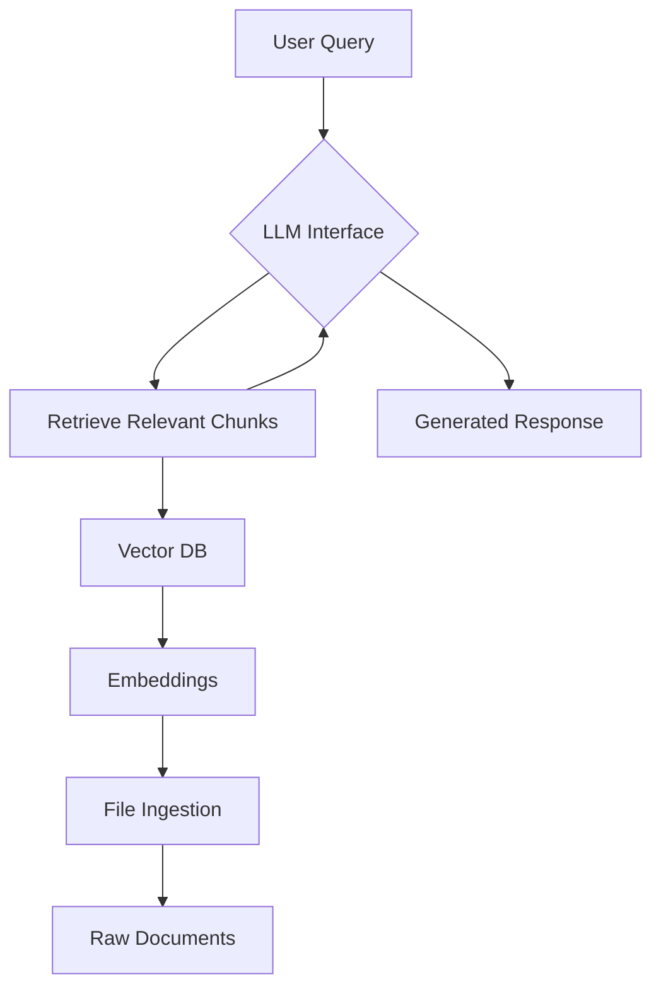
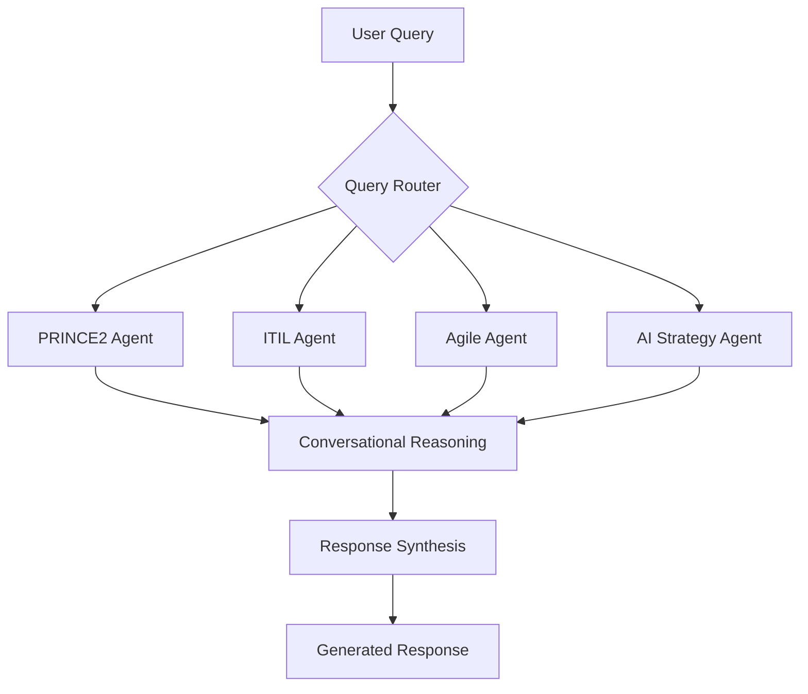
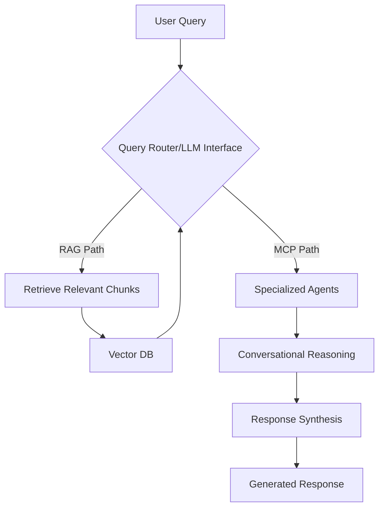

# AI-Powered Knowledge Assistant: Project Plan

## 1. Use Cases

Here are real-world scenarios where the AI-powered knowledge assistant will add significant value:

*   **Comparative Analysis:** Compare different project management methodologies (e.g., "Compare MSP vs PMBOK for a hybrid program").
*   **Problem Mitigation:** Suggest solutions for common project challenges (e.g., "Suggest mitigation for scope creep").
*   **Meeting Preparation:** Generate agendas or discussion points for project meetings (e.g., "Generate agenda for sprint review").
*   **Best Practice Retrieval:** Provide insights into industry best practices (e.g., "What’s the best practice for vendor de-scoping mid-contract?").
*   **Lessons Learned:** Access and summarize past experiences and lessons (e.g., "Show lessons learned on failed ERP rollouts").
*   **Certification Knowledge:** Answer questions related to specific certifications (e.g., "Explain the 7 PRINCE2 principles").
*   **Framework Application:** Guide the application of various frameworks to specific scenarios (e.g., "How to apply ITIL change management to a software deployment?").
*   **Role-Specific Guidance:** Offer tailored advice based on a user's role (e.g., "As a Junior Analyst, what should I focus on during a project kick-off?").
*   **Strategic Alignment:** Assist in aligning projects with broader organizational strategies (e.g., "How does Agile fit into a corporate digital transformation strategy?").
*   **RACI Chart Generation:** Automatically generate RACI charts based on project roles and tasks (e.g., "Generate a RACI chart for a hybrid Agile/Waterfall project.").

## 2. Personas

This AI-powered knowledge assistant will cater to a diverse range of professionals within the program, project, and product management domains. Key personas include:

*   **Senior PM (Project Manager):** Focuses on day-to-day project execution, risk management, stakeholder communication, and team leadership. Needs quick access to best practices, templates, and problem-solving strategies.
*   **Digital PMO (Project Management Office):** Oversees project portfolios, ensures methodology adherence, and drives process improvement. Requires insights into governance, reporting, and cross-project dependencies.
*   **Program Director:** Manages multiple related projects, focusing on strategic alignment, benefits realization, and overall program success. Needs high-level overviews, risk aggregation, and strategic decision support.
*   **CTO (Chief Technology Officer):** Responsible for the organization's technology strategy and implementation. Seeks guidance on technology-related project risks, innovation, and the integration of new methodologies.
*   **Transformation Lead:** Drives organizational change initiatives, often involving new processes, technologies, and cultural shifts. Requires frameworks for change management, stakeholder engagement, and strategic planning.
*   **Product Owner:** Represents the voice of the customer in Agile development, defining and prioritizing product backlog items. Needs insights into user stories, product roadmapping, and value delivery.
*   **Junior Analyst:** New to the field, seeking foundational knowledge, guidance on common tasks, and understanding of project management terminology and processes.

## 3. Architecture Overview

The AI-powered knowledge assistant will offer both RAG (Retrieval-Augmented Generation) and MCP (Multi-agent Conversational Programming) modes, allowing for flexible and powerful knowledge retrieval and reasoning. The system will be designed to seamlessly integrate these two approaches.

### RAG (Retrieval-Augmented Generation)

The RAG component will be responsible for efficient document-based referencing. It will follow a standard pipeline:

1.  **File Ingestion:** Raw documents (PDFs, slides, notes, CSVs, online content) will be ingested and processed.
2.  **Embedding:** The ingested text will be converted into numerical vector embeddings using a pre-trained language model.
3.  **Vector DB:** These embeddings will be stored in a specialized vector database for fast similarity search.
4.  **LLM Interface:** When a user query is received, relevant document chunks will be retrieved from the vector database based on semantic similarity. These retrieved chunks will then be provided as context to a large language model (LLM) to generate a grounded and accurate response.

### MCP (Multi-agent Conversational Programming)

The MCP component will enable sophisticated reasoning across specialized domains. It will operate as a multi-agent system with routing and delegation capabilities:

1.  **Query Routing:** Incoming user queries will be analyzed to determine the most relevant domain(s) or agent(s).
2.  **Agent Delegation:** The query will be delegated to one or more specialized agents (e.g., PRINCE2 agent, ITIL agent, Agile agent, AI strategy agent).
3.  **Conversational Reasoning:** Agents will engage in a conversational reasoning process, potentially collaborating with other agents, to formulate a comprehensive answer.
4.  **Response Synthesis:** The individual agent responses will be synthesized into a coherent and complete answer for the user.

### Combined Mode

For complex queries, the system can combine RAG and MCP. For example, an MCP agent might identify a need for specific document-based information, triggering a RAG query to retrieve relevant context before continuing its reasoning process.

## 4. Backend Tech Stack (MVP - Open-source or Low-cost)

For the Minimum Viable Product (MVP), the following open-source or low-cost technologies are recommended to build a robust and scalable backend:

*   **Python:** The primary programming language for its extensive ecosystem of AI/ML libraries.
*   **FastAPI:** A modern, fast (high-performance) web framework for building APIs with Python 3.7+ based on standard Python type hints. It's excellent for creating the LLM interface and agent orchestration.
*   **Supabase:** An open-source Firebase alternative. It provides a PostgreSQL database, authentication, instant APIs, and real-time subscriptions. It can serve as the primary relational database for user management, metadata, and potentially smaller structured datasets.
*   **SQLite:** A lightweight, file-based database. Ideal for local development, testing, and potentially for storing smaller, less frequently accessed data within the RAG pipeline (e.g., document metadata, processing logs).
*   **ChromaDB:** An open-source embedding database. It's an excellent choice for the vector database component of the RAG system, allowing for efficient storage and retrieval of document embeddings.
*   **HuggingFace Transformers:** A library providing thousands of pre-trained models for various tasks, including text embedding. It will be crucial for generating document embeddings for the RAG system.
*   **LangChain:** A framework for developing applications powered by language models. It will simplify the integration of LLMs, management of prompts, and orchestration of RAG pipelines.
*   **CrewAI:** A framework for orchestrating role-playing, autonomous AI agents. This will be the core technology for implementing the Multi-agent Conversational Programming (MCP) component, enabling agents to collaborate and reason.

## 5. Frontend UX/UI

For the frontend, a phased approach is recommended, starting with lightweight options for rapid prototyping and moving towards more scalable solutions as the project matures.

### Lightweight (MVP/Prototyping):

*   **Gradio:** Ideal for quickly building and sharing interactive web applications for machine learning models. It's excellent for rapid prototyping of the RAG and MCP interfaces, allowing for easy testing and demonstration of core functionalities.
*   **Streamlit:** Another powerful tool for creating data apps with Python. Similar to Gradio, it enables fast development of interactive dashboards and interfaces for the AI assistant.

### Scalable (Production-ready):

*   **React + Tailwind CSS + Next.js:** This combination provides a robust, scalable, and performant foundation for a production-ready web application. 
    *   **React:** A JavaScript library for building user interfaces, offering component-based development for reusability and maintainability.
    *   **Tailwind CSS:** A utility-first CSS framework for rapidly building custom designs. It allows for highly customizable and responsive UIs.
    *   **Next.js:** A React framework that enables server-side rendering (SSR) and static site generation (SSG), improving performance, SEO, and developer experience. It's suitable for building a full-fledged web application with user authentication, complex navigation, and a polished user experience.

## 6. Data Handling

Effective data handling is crucial for the AI-powered knowledge assistant, encompassing ingestion, secure storage, and access control.

### Data Ingestion Strategy

The system will be designed to ingest a wide variety of data formats, ensuring comprehensive knowledge coverage:

*   **PDFs:** Utilize libraries like `PyPDF2` or `pdfminer.six` for text extraction. For more complex layouts or scanned documents, consider OCR solutions (e.g., `Tesseract` via `pytesseract`).
*   **Slides (PPT/PPTX):** Employ libraries such as `python-pptx` to extract text, images, and potentially speaker notes from presentation files.
*   **Notes (Markdown, TXT, DOCX):** Markdown and plain text files can be directly ingested. For DOCX files, `python-docx` can be used for content extraction.
*   **CSVs:** Standard CSV parsing libraries (e.g., Python's built-in `csv` module or `pandas`) will be used to ingest structured data, which can then be converted into a suitable format for embedding or direct querying.
*   **Online Content (Web Pages):** Implement web scraping techniques using libraries like `BeautifulSoup` and `requests` to extract text from specified URLs. This can include articles, blog posts, and online documentation. Consideration will be given to respecting `robots.txt` and ethical scraping practices.

**Ingestion Process:**

1.  **Parsing:** Convert various document types into a standardized text format.
2.  **Chunking:** Break down long documents into smaller, semantically meaningful chunks to optimize retrieval and fit within LLM context windows.
3.  **Metadata Extraction:** Extract relevant metadata (e.g., source, author, date, topic, certification name) from documents during ingestion. This metadata will be stored alongside embeddings in the vector database and used for filtering and more precise retrieval.
4.  **Embedding Generation:** Generate vector embeddings for each text chunk using HuggingFace Transformers models.
5.  **Storage:** Store text chunks, embeddings, and metadata in the chosen databases.

### Secure Storage

Data security and integrity are paramount. The following options will be considered for secure storage:

*   **Local Storage (for MVP/Personal Use):** For initial development and personal use, data can be stored locally on the user's machine. This would involve local file systems for raw documents and a local ChromaDB instance for vector embeddings. SQLite can be used for metadata.
    *   **Pros:** Simplicity, low cost, full control over data.
    *   **Cons:** Limited scalability, no inherent backup/redundancy, single point of failure.

*   **Cloud-Based Options (for Scalability/Production):** For a production-capable system, cloud storage solutions offer scalability, redundancy, and managed security features.
    *   **Amazon S3 (AWS):** For raw document storage. Offers high durability, availability, and a wide range of security features (encryption at rest and in transit, access policies).
    *   **Google Cloud Storage (GCP):** Similar to S3, providing robust object storage with strong security and global availability.
    *   **Azure Blob Storage (Azure):** Microsoft's equivalent, offering scalable and secure object storage.
    *   **Managed Vector Databases:** For embeddings, consider managed services like Pinecone, Weaviate Cloud, or even a self-hosted ChromaDB instance on a cloud VM with persistent storage. Supabase (PostgreSQL with `pgvector` extension) can also serve as a vector store for smaller to medium-sized datasets.
    *   **Managed Relational Databases:** For metadata and user management, managed PostgreSQL services (AWS RDS, GCP Cloud SQL, Azure Database for PostgreSQL) are recommended for their scalability, backups, and security features.

### Access Control

Implementing robust access control mechanisms is essential to manage who can access and query the knowledge base.

*   **Gated Queries (Authenticated Access):** The primary mode of operation will be gated, requiring user authentication. This ensures that only authorized users can access the system.
    *   **User Authentication:** Supabase Auth (or a similar service like Auth0, Firebase Auth) will be used to manage user registration, login, and session management. This can support various authentication methods (email/password, social logins, SSO).
    *   **Role-Based Access Control (RBAC):** Define different user roles (e.g., Administrator, Senior PM, Junior Analyst) with varying levels of permissions. For instance, administrators might have full access to data ingestion and system configuration, while other roles have query-only access or access to specific subsets of information.
    *   **Data Segmentation:** Potentially segment the knowledge base based on user roles or teams, ensuring that users only retrieve information relevant and permissible to their context.

*   **Public Queries (Limited Access):** While the core system will be gated, a limited public-facing interface could be considered for demonstration or specific, non-sensitive queries. This would involve:
    *   **Read-Only Access:** Public queries would only allow read operations, preventing any data modification.
    *   **Curated Content:** Only a subset of publicly available or non-confidential information would be exposed through this interface.
    *   **Rate Limiting:** Implement strict rate limiting to prevent abuse and ensure system stability.

## 7. Query Examples

To illustrate the capabilities of the AI-powered knowledge assistant, here are various query examples, ranging from comparative analysis to practical application and historical insights:

*   **"What are the key differences between PRINCE2 and MSP?"**
    *   **Expected Outcome:** A concise comparison highlighting the core distinctions in principles, processes, and application between PRINCE2 (Projects In Controlled Environments) and MSP (Managing Successful Programmes), drawing from relevant certification materials and best practices.

*   **"Generate a RACI chart for a hybrid Agile/Waterfall project."**
    *   **Expected Outcome:** A structured RACI (Responsible, Accountable, Consulted, Informed) chart template, pre-populated with typical roles and activities for a hybrid project, along with explanations of how to adapt it for specific scenarios. This would leverage knowledge from both Agile and Waterfall frameworks.

*   **"What’s the best practice for vendor de-scoping mid-contract?"**
    *   **Expected Outcome:** A step-by-step guide or a set of recommendations for managing changes to vendor contracts, specifically focusing on reducing scope. This would include legal considerations, communication strategies, risk mitigation, and negotiation tactics, drawing from project management and procurement best practices.

*   **"Show lessons learned on failed ERP rollouts."**
    *   **Expected Outcome:** A summary of common pitfalls, challenges, and key lessons extracted from historical data or case studies related to unsuccessful Enterprise Resource Planning (ERP) system implementations. This would provide actionable insights to avoid similar mistakes in future projects.

*   **"As a Product Owner, how do I prioritize features for the next sprint given conflicting stakeholder demands?"**
    *   **Expected Outcome:** Guidance on various prioritization techniques (e.g., MoSCoW, Kano Model, Weighted Shortest Job First), strategies for stakeholder management, and communication best practices to resolve conflicts and ensure alignment with product vision.

*   **"Explain the concept of 'Earned Value Management' and provide a simple example."**
    *   **Expected Outcome:** A clear explanation of EVM principles, key metrics (PV, EV, AC, CV, SV, CPI, SPI), and a practical, simplified example demonstrating its calculation and interpretation for project performance tracking.

*   **"What are the critical success factors for a large-scale digital transformation program?"**
    *   **Expected Outcome:** A list of essential elements and conditions that contribute to the successful execution of digital transformation initiatives, covering aspects like leadership commitment, change management, technology adoption, and cultural alignment.

## 8. Scalability & Deployment

To ensure the AI-powered knowledge assistant can handle increasing data volumes, user loads, and computational demands, scalability and deployment considerations are paramount.

### Recommendations to Scale

*   **Vector Database Sharding/Partitioning:** As the volume of ingested documents and their embeddings grows, a single vector database instance may become a bottleneck. Sharding (distributing data across multiple database instances) or partitioning (dividing data within a single instance) will be crucial. This can be implemented based on document categories, time, or other metadata. Managed vector database services often provide built-in sharding capabilities.

*   **Asynchronous Pipelines:** For data ingestion and embedding generation, implement asynchronous processing. This means that when a new document is uploaded, it is added to a queue, and a separate worker process handles its parsing, chunking, embedding, and storage. This prevents the main application from being blocked during computationally intensive tasks.
    *   **Technologies:** Message queues like RabbitMQ, Apache Kafka, or cloud-native services like AWS SQS/SNS, GCP Pub/Sub, or Azure Service Bus can be used to manage these queues. Python libraries like Celery can be used for distributed task queues.

*   **Streaming Ingestion:** For continuous updates (e.g., from RSS feeds or synced notes), implement streaming ingestion. This involves processing data in small, continuous batches rather than large, infrequent ones. This reduces latency and ensures the knowledge base is always up-to-date.

*   **Microservices Architecture:** As the system grows in complexity, consider breaking down the monolithic application into smaller, independent microservices. For example, separate services for:
    *   **Ingestion Service:** Handles all data parsing, chunking, and embedding.
    *   **RAG Service:** Manages vector database interactions and context retrieval.
    *   **MCP Orchestration Service:** Manages agent routing and conversational flows.
    *   **API Gateway:** Provides a single entry point for all client requests, routing them to the appropriate microservice.

*   **Load Balancing and Auto-scaling:** Deploy the application components behind load balancers to distribute incoming traffic. Implement auto-scaling groups (in cloud environments) to automatically adjust the number of running instances based on demand, ensuring high availability and performance.

*   **Caching:** Implement caching mechanisms at various layers (e.g., API responses, frequently accessed document chunks, LLM responses) to reduce redundant computations and improve response times.

### Cloud Optionality

The architecture will be designed with cloud optionality in mind, allowing for flexible deployment across various environments:

*   **AWS/GCP/Azure:** The recommended tech stack (Python, FastAPI, Supabase, ChromaDB, HuggingFace, LangChain, CrewAI) is largely cloud-agnostic. Deployment to major cloud providers would involve:
    *   **Compute:** AWS EC2, GCP Compute Engine, Azure Virtual Machines, or container orchestration services like Kubernetes (EKS, GKE, AKS) for running FastAPI applications and CrewAI agents.
    *   **Databases:** Managed services for PostgreSQL (AWS RDS, GCP Cloud SQL, Azure Database for PostgreSQL) and object storage (AWS S3, GCP Cloud Storage, Azure Blob Storage).
    *   **Vector Databases:** Managed services like Pinecone, Weaviate, or self-hosting ChromaDB on cloud compute instances.
    *   **Serverless Functions:** For specific, event-driven tasks (e.g., triggering ingestion pipelines on new file uploads), serverless functions (AWS Lambda, GCP Cloud Functions, Azure Functions) can be utilized.

*   **Fully Local Deployment:** For users who prefer complete control over their data and infrastructure, the system can be deployed entirely on-premises. This would involve:
    *   **Local Servers/VMs:** Running Python/FastAPI applications on local hardware.
    *   **Local Databases:** Self-hosting PostgreSQL, ChromaDB, and SQLite instances.
    *   **Local Storage:** Utilizing local file systems for document storage.
    *   **Considerations:** Requires manual management of infrastructure, backups, and scaling.

### Agent Orchestration Patterns for MCP

For the Multi-agent Conversational Programming (MCP) component, effective orchestration patterns are key to managing complex interactions between specialized agents:

*   **Hierarchical Orchestration:** A master agent (or a central orchestrator) receives the user query and delegates tasks to sub-agents based on their domain expertise. Sub-agents may then report back to the master agent, which synthesizes the final response.

*   **Collaborative/Swarm Orchestration:** Agents can communicate directly with each other, forming a dynamic network to solve problems. This often involves a shared blackboard or message bus where agents can post information and requests, and other agents can pick them up.

*   **Router-Executor Pattern:** A dedicated router component analyzes the incoming query and determines which agent(s) are best suited to handle it. The selected agent(s) then execute their specific tasks. This aligns well with the initial MCP architecture described.

*   **State Machine/Workflow-based Orchestration:** Define explicit workflows or state machines that dictate the sequence of agent interactions for specific types of queries. This provides more control and predictability for complex multi-step reasoning processes.

*   **Dynamic Agent Creation:** For highly specialized or transient tasks, agents could be dynamically instantiated as needed, rather than having a fixed set of pre-defined agents. This offers greater flexibility.

CrewAI, as chosen for the tech stack, inherently supports many of these patterns, allowing for the definition of roles, tasks, and collaboration mechanisms between agents.

## 9. Enhancement Roadmap

To ensure the long-term value and evolution of the AI-powered knowledge assistant, a phased enhancement roadmap is proposed. This roadmap outlines future integrations, features, and capabilities to be developed after the initial MVP is established.

### Phase 1: Core Functionality (MVP)

*   **Focus:** Establish the core RAG and MCP functionalities.
*   **Features:**
    *   Manual ingestion of PDFs, slides, and notes.
    *   Basic RAG-based chatbot interface (Gradio/Streamlit).
    *   Initial set of specialized MCP agents (e.g., PRINCE2, Agile, ITIL).
    *   Local deployment with SQLite and ChromaDB.

### Phase 2: Integrations and Automation

*   **Focus:** Enhance data ingestion and user accessibility.
*   **Features:**
    *   **Integration with RSS Feeds:** Automatically ingest articles and updates from relevant industry blogs, news sites, and certification portals.
    *   **Slack/Teams/Outlook Bots:** Develop bots to allow users to query the knowledge assistant directly from their preferred communication and collaboration tools.
    *   **Auto-refresh from Synced Notes:** Integrate with note-taking applications (e.g., Obsidian, Notion, Evernote) to automatically sync and update the knowledge base as new notes are created or modified.
    *   **Cloud Deployment (Optional):** Migrate to a cloud-based infrastructure for improved scalability and reliability.

### Phase 3: Advanced AI and Personalization

*   **Focus:** Improve the intelligence and personalization of the assistant.
*   **Features:**
    *   **Fine-tuning Domain-specific LLMs:** Fine-tune smaller, open-source LLMs on the ingested corpus of professional certifications and notes. This will create highly specialized models that can provide more accurate and contextually aware responses for specific domains.
    *   **Proactive Assistance:** Develop capabilities for the assistant to proactively offer insights or suggestions based on user context (e.g., upcoming meetings in their calendar, recent project activities).
    *   **Personalized Dashboards:** Create personalized dashboards for different user personas, highlighting relevant metrics, recent updates, and frequently accessed knowledge areas.
    *   **Multi-modal RAG:** Extend the RAG system to handle and retrieve information from images, diagrams, and tables within documents.

### Phase 4: Enterprise-grade Features

*   **Focus:** Prepare the system for wider adoption within an organization.
*   **Features:**
    *   **Advanced Analytics and Reporting:** Provide detailed analytics on system usage, popular queries, and knowledge gaps. Generate reports for PMOs and leadership.
    *   **Integration with Enterprise Systems:** Connect with enterprise systems like Jira, Confluence, or SharePoint to ingest project data and provide in-context assistance.
    *   **Knowledge Graph Integration:** Build a knowledge graph to represent relationships between different concepts, frameworks, and projects, enabling more sophisticated reasoning and discovery.
    *   **Federated Search:** Allow the assistant to query other internal knowledge bases and systems, providing a single, unified interface for all enterprise knowledge.

## Implementation Blueprint: Milestone-based Phasing

This project will be executed in distinct phases, each building upon the previous one, to ensure a structured and manageable development process. This phased approach allows for early validation, iterative improvements, and clear milestones.

### Phase 1: Foundation & Basic RAG (Months 1-3)

**Goal:** Establish the core infrastructure and implement a functional RAG system for document-based referencing.

**Milestones:**

*   **M1.1: Environment Setup & Core Libraries:**
    *   Set up Python development environment.
    *   Install FastAPI, Supabase client, ChromaDB, HuggingFace Transformers, LangChain.
    *   Initialize local Supabase project and database.

*   **M1.2: Data Ingestion Pipeline (MVP):**
    *   Develop scripts for ingesting PDFs, notes (Markdown/TXT), and CSVs.
    *   Implement text extraction, chunking, and metadata extraction.
    *   Integrate HuggingFace Transformers for embedding generation.
    *   Store embeddings and metadata in ChromaDB (local instance).

*   **M1.3: Basic RAG Chatbot:**
    *   Develop a FastAPI backend endpoint for RAG queries.
    *   Integrate LangChain for orchestrating retrieval and LLM interaction.
    *   Build a simple frontend using Gradio or Streamlit for text input and output.
    *   Enable basic query examples like "What are the key differences between PRINCE2 and MSP?" based on ingested documents.

**Deliverables:**

*   Functional RAG system with document ingestion and basic querying.
*   Initial set of ingested documents.
*   Gradio/Streamlit prototype.

### Phase 2: Multi-agent Conversational Programming (MCP) & Enhanced RAG (Months 4-6)

**Goal:** Introduce multi-agent reasoning capabilities and enhance the RAG system with more data types and advanced features.

**Milestones:**

*   **M2.1: MCP Framework Integration:**
    *   Integrate CrewAI into the backend.
    *   Define initial specialized agents (e.g., PRINCE2 Agent, Agile Agent) with their respective roles and tools.
    *   Implement basic agent routing logic.

*   **M2.2: Hybrid Query Handling:**
    *   Develop logic to route queries to either RAG, MCP, or a combination based on query intent.
    *   Enable MCP agents to trigger RAG queries for contextual information.
    *   Implement query examples like "Generate a RACI chart for a hybrid Agile/Waterfall project."

*   **M2.3: Advanced Data Ingestion:**
    *   Extend ingestion pipeline to handle slides (PPT/PPTX) and online content (web scraping).
    *   Improve chunking strategies for complex document types.

*   **M2.4: User Authentication & Basic Access Control:**
    *   Integrate Supabase Auth for user registration and login.
    *   Implement basic gated access for the application.

**Deliverables:**

*   Functional MCP system with specialized agents.
*   Hybrid RAG/MCP query processing.
*   Enhanced data ingestion capabilities.
*   Authenticated user access.

### Phase 3: Scalability, Production Readiness & Advanced UX (Months 7-9)

**Goal:** Prepare the system for production deployment, improve scalability, and develop a more robust and user-friendly frontend.

**Milestones:**

*   **M3.1: Cloud Infrastructure Setup:**
    *   Set up cloud accounts (AWS/GCP/Azure).
    *   Deploy FastAPI backend to cloud compute instances (e.g., EC2, Compute Engine).
    *   Migrate ChromaDB to a managed vector database service or self-hosted on cloud VMs.
    *   Migrate Supabase to a managed PostgreSQL service.
    *   Set up cloud object storage for raw documents (S3, GCS, Azure Blob).

*   **M3.2: Scalability Enhancements:**
    *   Implement asynchronous ingestion pipelines using message queues (e.g., Celery with RabbitMQ).
    *   Configure load balancing and auto-scaling for backend services.
    *   Implement caching mechanisms.

*   **M3.3: Production Frontend (React + Next.js + Tailwind CSS):**
    *   Develop a production-grade frontend with a polished UX/UI.
    *   Implement responsive design and intuitive navigation.
    *   Integrate with the FastAPI backend for seamless interaction.

*   **M3.4: Advanced Access Control & Monitoring:**
    *   Implement Role-Based Access Control (RBAC) with different user roles.
    *   Set up logging, monitoring, and alerting for system health and performance.

**Deliverables:**

*   Scalable, cloud-deployed AI knowledge assistant.
*   Production-ready React/Next.js frontend.
*   Robust access control and monitoring.

### Phase 4: Roadmap Enhancements & Continuous Improvement (Months 10+)

**Goal:** Implement features from the enhancement roadmap and establish a continuous improvement cycle.

**Milestones:**

*   **M4.1: Integration with External Services:**
    *   Implement RSS feed integration for continuous content updates.
    *   Develop Slack/Teams/Outlook bots for direct interaction.
    *   Integrate with note-taking apps for auto-refresh.

*   **M4.2: Advanced AI & Personalization:**
    *   Explore and implement fine-tuning of domain-specific LLMs.
    *   Develop proactive assistance features.
    *   Implement personalized dashboards.

*   **M4.3: Enterprise Features & Knowledge Graph:**
    *   Integrate with enterprise systems (Jira, Confluence).
    *   Begin development of a knowledge graph for enhanced reasoning.
    *   Explore federated search capabilities.

**Deliverables:**

*   Expanded feature set from the enhancement roadmap.
*   Continuous integration and deployment (CI/CD) pipeline for ongoing updates.
*   User feedback loop for iterative improvements.

This phased approach provides a clear path from concept to a production-capable, continuously evolving AI-powered knowledge assistant.

